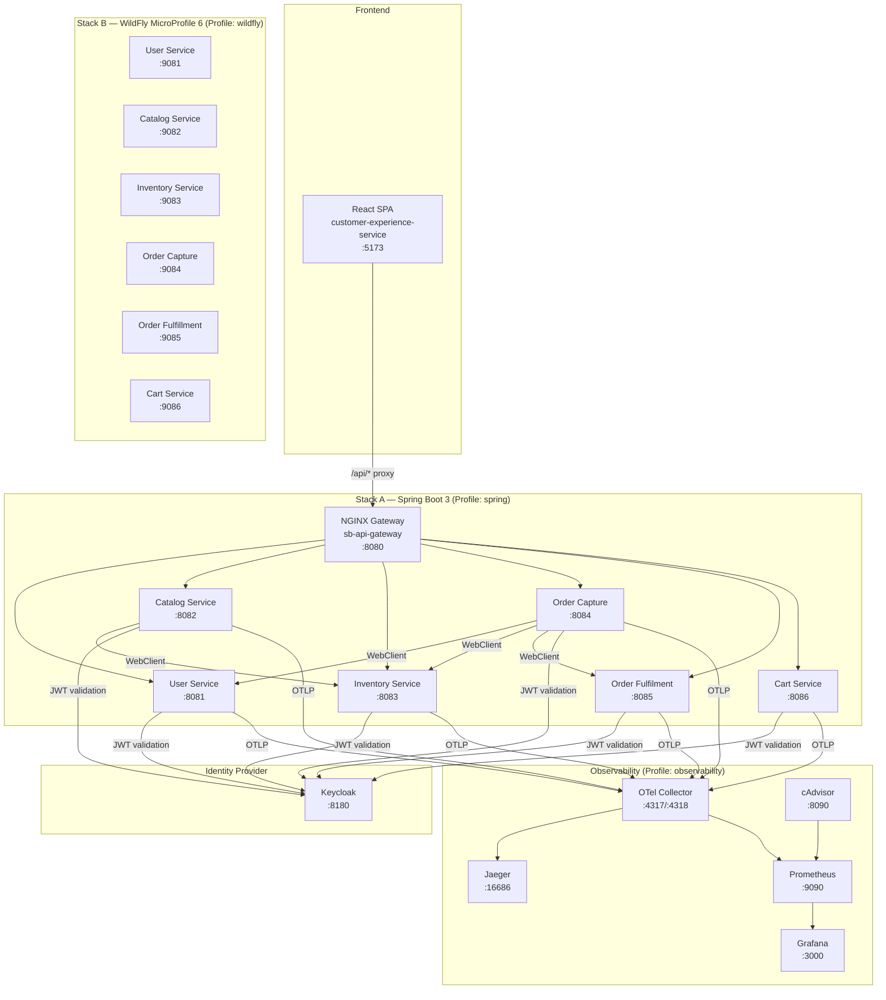
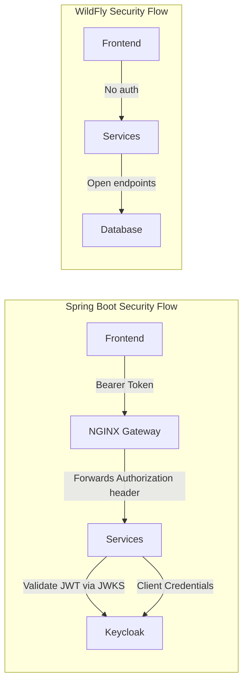
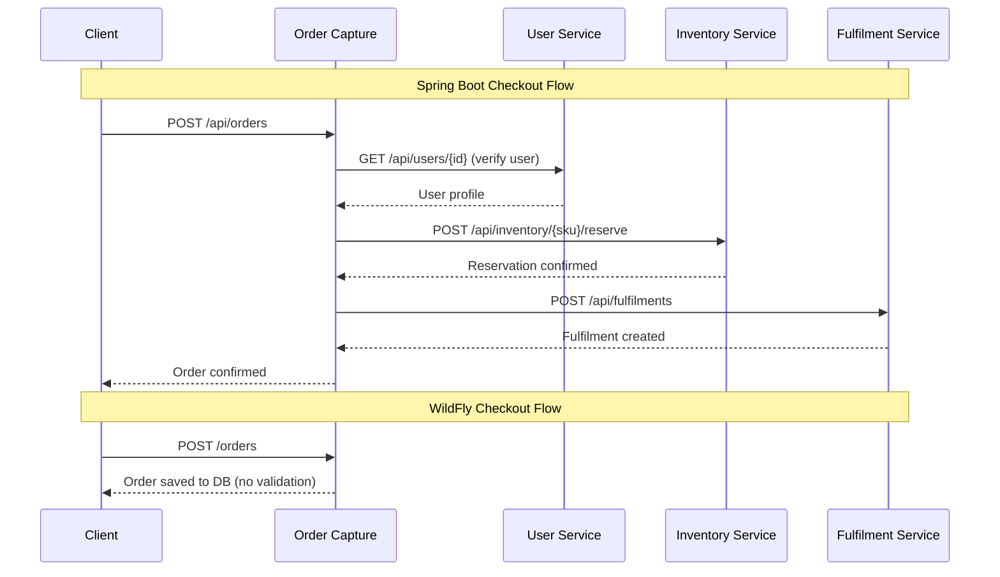

# Microservices Showdown

A head-to-head architectural comparison of **Spring Boot 3** and **WildFly MicroProfile 6** implementing the same pet store application (JPetStore). Both stacks expose identical business functionality through a shared React frontend, backed by separate PostgreSQL databases and a common observability pipeline.

---

## System Architecture



---

## Repository Structure

```
microservices-showdown/
├── customer-experience-service/   # React 19 + TypeScript + Vite frontend
├── spring-boot/                   # Stack A — Spring Boot 3, Java 21
│   ├── api-gateway/               # Spring Cloud Gateway (alternative to NGINX)
│   ├── nginx/                     # NGINX reverse proxy config (active gateway)
│   ├── user-service/              # User registration, login, JWT issuance
│   ├── catalog-service/           # Categories, products, items (SKUs)
│   ├── inventory-service/         # Stock tracking, reservations
│   ├── order-capture-service/     # Order orchestration (multi-service checkout)
│   ├── order-fulfilment-service/  # Shipping lifecycle management
│   └── cart-service/              # Redis-backed shopping cart
├── wildfly-microprofile/          # Stack B — WildFly, Java 17, Jakarta EE 10
│   ├── api-gateway/               # NGINX config (not deployed in Docker)
│   ├── user-service/              # User management (plaintext passwords)
│   ├── catalog-service/           # Catalog CRUD (no inventory integration)
│   ├── inventory-service/         # Stock CRUD (no reservations)
│   ├── order-capture-service/     # Order recording (standalone, no orchestration)
│   ├── order-fulfillment-service/ # Shipping lifecycle management
│   └── cart-service/              # Redis-backed cart (Jedis, sentinels unused)
├── keycloak/                      # Realm export (jpetstore realm, clients, roles)
├── observability/                 # Prometheus, Grafana, Jaeger, OTel, cAdvisor
├── load-testing/                  # JMeter test plans and execution guides
├── docker-compose.yml             # Multi-profile orchestration
└── .env.example                   # Environment variable template
```

---

## Stack Comparison

### Technology Matrix

| Dimension | Spring Boot (Stack A) | WildFly MicroProfile (Stack B) |
|---|---|---|
| **Language** | Java 21 | Java 17 |
| **Framework** | Spring Boot 3.x | Jakarta EE 10, MicroProfile 6.1 |
| **Web Layer** | Spring MVC (Servlet) | JAX-RS (Jakarta REST) |
| **Database** | Spring Data JPA | Jakarta Persistence (JPA) |
| **Packaging** | Executable JAR | WAR deployed on WildFly |
| **Gateway** | NGINX (Docker) + Spring Cloud Gateway (alternative) | NGINX config (manual, not containerized) |
| **Security** | OAuth2 Resource Server + Custom JWT | None |
| **Inter-service Calls** | WebClient with Circuit Breakers | None (standalone services) |
| **Cart Database** | Redis (Spring Data Redis) | Redis (Jedis direct pool) |
| **Resilience** | Resilience4j (Circuit Breaker, Retry) | None |

### Security Topology



### Inter-Service Communication

The Spring Boot stack uses synchronous WebClient calls between services during the checkout flow. The WildFly stack has no inter-service communication; each service reads from and writes to its own database independently.



---

## Quick Start

### Prerequisites
- Docker Engine 24+ and Docker Compose v2
- Copy `.env.example` to `.env` and fill in all values

### Environment Variables

| Variable | Purpose |
|---|---|
| `DB_USER` | PostgreSQL username for all databases |
| `DB_PASSWORD` | PostgreSQL password for all databases |
| `GRAFANA_ADMIN_USER` | Grafana admin login |
| `GRAFANA_ADMIN_PASSWORD` | Grafana admin password |
| `KEYCLOAK_ADMIN_USER` | Keycloak admin console login |
| `KEYCLOAK_ADMIN_PASSWORD` | Keycloak admin console password |
| `KEYCLOAK_CLIENT_SECRET` | OAuth2 client secret (must match `keycloak/realm-export.json`) |

### Starting the Stacks

```bash
# Start the observability pipeline
docker compose --profile observability up -d

# Start the Spring Boot stack (Stack A)
docker compose --profile spring up -d

# OR start the WildFly stack (Stack B)
docker compose --profile wildfly up -d

# Start the React frontend
cd customer-experience-service && npm install && npm run dev
```

> **Note**: Run only one backend stack at a time for clean performance measurements.

---

## Service Port Map

| Service | Spring Boot | WildFly |
|---|---|---|
| API Gateway (NGINX) | `8080` | — (not containerized) |
| User Service | `8081` | `9081` |
| Catalog Service | `8082` | `9082` |
| Inventory Service | `8083` | `9083` |
| Order Capture Service | `8084` | `9084` |
| Order Fulfilment Service | `8085` | `9085` |
| Cart Service | `8086` | `9086` |
| Keycloak | `8180` | `8180` |
| React Frontend | `5173` | `5173` |

---

## Keycloak Configuration

The Keycloak realm is pre-configured via `keycloak/realm-export.json`:

| Setting | Value |
|---|---|
| Realm | `jpetstore` |
| Confidential Client | `jpetstore-gateway` (used for inter-service Client Credentials flow) |
| Public Client | `jpetstore-frontend` (used by the React SPA) |
| Roles | `ADMIN`, `CUSTOMER` |
| Test User | `testuser` / `testpass123` (role: `CUSTOMER`) |
| Admin User | `admin` / `admin123` (role: `ADMIN`) |

---

## Observability URLs

| Tool | URL | Credentials |
|---|---|---|
| Grafana | http://localhost:3000 | `GRAFANA_ADMIN_USER` / `GRAFANA_ADMIN_PASSWORD` |
| Prometheus | http://localhost:9090 | — |
| Jaeger UI | http://localhost:16686 | — |
| cAdvisor | http://localhost:8090 | — |
| Keycloak Console | http://localhost:8180 | `KEYCLOAK_ADMIN_USER` / `KEYCLOAK_ADMIN_PASSWORD` |

---

## Known Issues and Configuration Gaps

1. **WildFly Datasource Hardcoding**: All WildFly service Dockerfiles register PostgreSQL datasources with hardcoded credentials (`showdown` / `showdown123`) during image build. The `DB_USER` and `DB_PASSWORD` environment variables from `docker-compose.yml` are ignored, making credential rotation impossible without rebuilding images.

2. **Redis Sentinel Bypass**: The WildFly Cart Service ignores the deployed Redis Sentinel cluster. Despite `docker-compose.yml` provisioning 3 sentinel nodes and passing `REDIS_SENTINEL_HOSTS` to the container, the Java code creates a direct `JedisPool` connection to the master. Automatic failover is not functional.

3. **Prometheus Target DNS Errors**:
   - `wf-api-gateway:8080` is listed as a scrape target but does not exist as a container.
   - `wf-order-fulfilment-service:8080` uses UK spelling while the container is named `wf-order-fulfillment-service` (US spelling).

4. **WildFly Gateway Not Deployed**: The `wildfly-microprofile/api-gateway` module has an empty Dockerfile and no corresponding service in `docker-compose.yml`, leaving the WildFly stack without a unified gateway.

5. **WildFly Security Absent**: No WildFly service performs JWT validation, password hashing, or endpoint authorization. Passwords are stored and compared in plaintext.

---

## Module Documentation

Each module contains its own `README.md` with detailed documentation:

| Module | Description |
|---|---|
| [customer-experience-service](customer-experience-service/) | React 19 SPA storefront |
| [spring-boot/api-gateway](spring-boot/api-gateway/) | Spring Cloud Gateway + NGINX proxy |
| [spring-boot/user-service](spring-boot/user-service/) | User management with BCrypt and custom JWT |
| [spring-boot/catalog-service](spring-boot/catalog-service/) | Catalog with inventory enrichment |
| [spring-boot/inventory-service](spring-boot/inventory-service/) | Stock tracking with reservations |
| [spring-boot/order-capture-service](spring-boot/order-capture-service/) | Distributed checkout orchestration |
| [spring-boot/order-fulfilment-service](spring-boot/order-fulfilment-service/) | Shipping lifecycle management |
| [spring-boot/cart-service](spring-boot/cart-service/) | Redis-backed shopping cart |
| [wildfly-microprofile/api-gateway](wildfly-microprofile/api-gateway/) | NGINX config (not containerized) |
| [wildfly-microprofile/user-service](wildfly-microprofile/user-service/) | User management (plaintext passwords) |
| [wildfly-microprofile/catalog-service](wildfly-microprofile/catalog-service/) | Standalone catalog CRUD |
| [wildfly-microprofile/inventory-service](wildfly-microprofile/inventory-service/) | Standalone inventory CRUD |
| [wildfly-microprofile/order-capture-service](wildfly-microprofile/order-capture-service/) | Standalone order recording |
| [wildfly-microprofile/order-fulfillment-service](wildfly-microprofile/order-fulfillment-service/) | Shipping lifecycle management |
| [wildfly-microprofile/cart-service](wildfly-microprofile/cart-service/) | Redis cart (Jedis, sentinels unused) |
| [observability](observability/) | Prometheus, Grafana, Jaeger, OTel, cAdvisor |
| [load-testing](load-testing/) | JMeter test plans and benchmarking guide |
