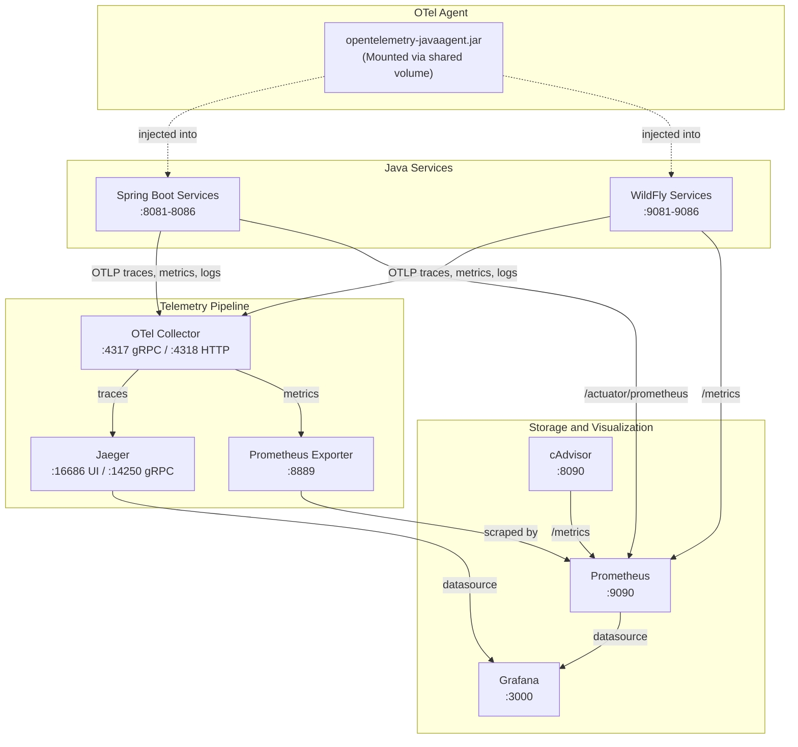

# Observability Stack

The **Observability Stack** provides comprehensive telemetry for both the Spring Boot and WildFly microservice clusters. It collects metrics, distributed traces, and logs through an OpenTelemetry-based pipeline with Prometheus, Grafana, Jaeger, and cAdvisor.

---

## Technology Stack

| Component | Image | Version | Purpose |
|---|---|---|---|
| OpenTelemetry Collector | `otel/opentelemetry-collector-contrib` | `0.101.0` | Central telemetry receiver, processor, and exporter. |
| Prometheus | `prom/prometheus` | `v2.51.2` | Time-series metrics storage and querying. |
| Grafana | `grafana/grafana` | `10.4.2` | Metrics visualization and dashboarding. |
| Jaeger | `jaegertracing/all-in-one` | `1.57` | Distributed trace storage and visualization. |
| cAdvisor | `gcr.io/cadvisor/cadvisor` | `v0.49.1` | Container-level resource metrics (CPU, memory, network). |
| OTel Java Agent | Custom build | — | Auto-instruments Java services for trace/metric emission. |

---

## Architecture

---

## Data Flow

### Traces
1. The OTel Java Agent auto-instruments each JVM process at startup via the `JAVA_TOOL_OPTIONS` environment variable.
2. Trace spans are emitted via OTLP to the OTel Collector at `otel-collector:4318` (HTTP).
3. The Collector batches and forwards traces to Jaeger at `jaeger:4317` (gRPC).
4. Jaeger provides a query UI at `http://localhost:16686`.

### Metrics
Metrics are collected through two parallel channels:

1. **Pull-based (Prometheus direct scrape)**:
   - Spring Boot services expose Micrometer metrics at `/actuator/prometheus`.
   - WildFly services expose MicroProfile Metrics at `/metrics`.
   - cAdvisor exposes container resource metrics at `/metrics`.
   - Prometheus scrapes all targets at a 15-second interval.

2. **Push-based (OTLP via OTel Collector)**:
   - The OTel Java Agent pushes JVM and application metrics to the Collector.
   - The Collector exports them on a Prometheus-compatible endpoint at `:8889`.
   - Prometheus scrapes this endpoint as the `otel-collector` job.

### Logs
- The OTel Collector receives logs via OTLP.
- Logs are exported to `stdout` via the `debug` exporter, visible in `docker logs otel-collector`.

---

## Prometheus Scrape Configuration

Defined in `observability/prometheus/prometheus.yml`:

| Job Name | Metrics Path | Targets |
|---|---|---|
| `spring-boot-services` | `/actuator/prometheus` | `sb-user-service:8081`, `sb-catalog-service:8082`, `sb-inventory-service:8083`, `sb-order-capture-service:8084`, `sb-order-fulfilment-service:8085`, `sb-cart-service:8086` |
| `wildfly-services` | `/metrics` | `wf-api-gateway:8080`, `wf-user-service:8080`, `wf-catalog-service:8080`, `wf-inventory-service:8080`, `wf-order-capture-service:8080`, `wf-order-fulfilment-service:8080`, `wf-cart-service:8080` |
| `otel-collector` | `/metrics` | `otel-collector:8889` |
| `cadvisor` | `/metrics` | `cadvisor:8080` |

---

## Grafana Provisioning

Grafana is auto-provisioned with:
- **Datasources**: Prometheus (`http://prometheus:9090`) as default, Jaeger (`http://jaeger:16686`).
- **Dashboards**: A pre-built `spring-boot-overview.json` dashboard is loaded from `provisioning/dashboards/`.

### Access
- **URL**: `http://localhost:3000`
- **Credentials**: Configured via `GRAFANA_ADMIN_USER` and `GRAFANA_ADMIN_PASSWORD` environment variables.

---

## OTel Agent Distribution

The OTel Java Agent JAR is distributed to all services via a shared Docker volume:

1. The `otel-agent-init` container copies `opentelemetry-javaagent.jar` into the `otel-agent-vol` volume.
2. All Java service containers mount this volume at `/otel-agent:ro`.
3. Each service references the agent via `JAVA_TOOL_OPTIONS: "-javaagent:/otel-agent/opentelemetry-javaagent.jar"`.

---

## Access URLs

| Tool | URL |
|---|---|
| Grafana | `http://localhost:3000` |
| Prometheus | `http://localhost:9090` |
| Jaeger UI | `http://localhost:16686` |
| cAdvisor | `http://localhost:8090` |

---

## Known Issues

1. **WildFly API Gateway DNS Failure**: `prometheus.yml` lists `wf-api-gateway:8080` as a scrape target, but no container with this name exists in `docker-compose.yml`. This target will fail to resolve.
2. **WildFly Fulfillment Spelling Mismatch**: The scrape target `wf-order-fulfilment-service:8080` uses UK spelling, while the container is named `wf-order-fulfillment-service` (US spelling). Metrics for this service are not collected.
3. **OTel Agent Profile Dependency**: The `otel-agent-init` container is included in the `spring` and `wildfly` profiles, but the OTel Collector and Jaeger are only in the `observability` profile. Running a service stack without the observability profile causes OTLP export failures (non-fatal, logged as warnings).
