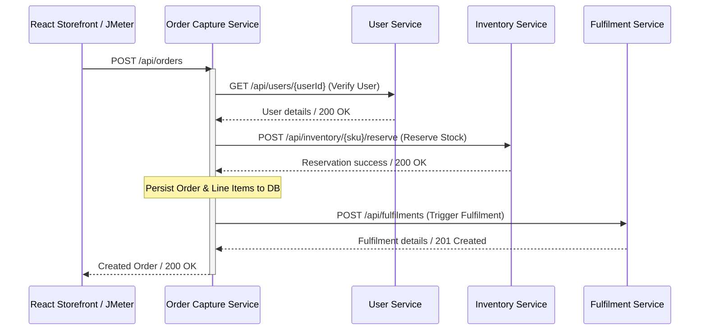

# Order Capture Service — Spring Boot

The **Order Capture Service** orchestrates the checkout process: validating customer existence, reserving inventory stock, persisting orders to the database, and triggering order fulfilment.

---

## Technology Stack

- **Core Framework**: Spring Boot 3 (Java 21)
- **Database Access**: Spring Data JPA & Hibernate
- **Database**: PostgreSQL (backed by `sb-order-capture-db` container)
- **Security**: Spring Security OAuth2 Resource Server (Keycloak public key validation)
- **Downstream Integrations**: Spring Webflux WebClient (with Client Credentials token injection)
- **Resilience Engine**: Resilience4j (Circuit Breakers and Retries)

---

## Orchestration Request Flow & Clients

When a client submits an order via `POST /api/orders`, the service executes the following sequence:

### Downstream Clients
- **`UserServiceClient`**: Communicates with `sb-user-service`.
- **`InventoryClient`**: Communicates with `sb-inventory-service`.
- **`OrderFulfilmentClient`**: Communicates with `sb-order-fulfilment-service`.

---

## Resilience & Circuit Breaker Policies

To survive downstream service failures, the `InventoryClient` is wrapped with **Resilience4j Circuit Breaker** and **Retry** patterns:

1. **Configurations**:
   - Resilience4j is configured on `reserveStock` and `checkAvailability` calls.
2. **Optimistic Fallback**:
   - If the Inventory Service is offline or returns server errors, the circuit opens.
   - The registered fallback method (`reserveStockFallback`) returns `true` (optimistic reservation success). This allows the checkout process to complete successfully without blocking the customer. Stock discrepancy resolution is delegated to asynchronous reconciliation.

---

## Database Schema

Two tables are managed in PostgreSQL:

### 1. `orders` Table
- `id` (VARCHAR(20), Primary Key) — Formatted as `ORD-<8-character UUID hash>`
- `user_id` (VARCHAR(50), Not Null)
- `customer_name` (VARCHAR(255), Not Null)
- `status` (VARCHAR, Not Null, Default: `"CREATED"`) — Enum values: `CREATED`, `PAID`, `SHIPPED`, `CANCELLED`
- `total_amount` (NUMERIC(12,2), Not Null)
- `shipping_address` (VARCHAR(500))
- `created_at` (TIMESTAMP, Not Null)
- `updated_at` (TIMESTAMP)

### 2. `order_line_items` Table
- `id` (VARCHAR(20), Primary Key) — Formatted as `OLI-<8-character UUID hash>`
- `item_sku` (VARCHAR, Not Null)
- `product_name` (VARCHAR)
- `quantity` (INTEGER, Not Null)
- `unit_price` (NUMERIC(10,2), Not Null)
- `line_total` (NUMERIC(10,2), Not Null)
- `order_id` (VARCHAR(20), Foreign Key referencing `orders(id)`)

---

## API Endpoints

- **`POST /api/orders`**: Create a new order (Supports guest checkout, permitting anonymous access).
  - **Body**: `CreateOrderRequest` (userId, customerName, shippingAddress, lineItems)
- **`GET /api/orders/{id}`**: Get details of a specific order.
- **`GET /api/orders/user/{userId}`**: List all orders placed by a specific user.
- **`GET /api/orders`**: List all orders.

---

## Environment Variables & Configuration

Declared in `src/main/resources/application.properties`:

| Property Path | Environment Variable | Default Value | Description |
|---|---|---|---|
| `spring.datasource.url` | `SPRING_DATASOURCE_URL` | `jdbc:postgresql://sb-order-capture-db:5432/ordercapturedb` | JDBC connection URL. |
| `services.user.url` | `SERVICES_USER_URL` | `http://localhost:8081` | Host URL for User Service. |
| `services.inventory.url` | `SERVICES_INVENTORY_URL` | `http://localhost:8083` | Host URL for Inventory Service. |
| `services.fulfilment.url` | `SERVICES_FULFILMENT_URL` | `http://localhost:8085` | Host URL for Fulfilment Service. |
| `spring.security.oauth2.resourceserver.jwt.issuer-uri` | `KEYCLOAK_URL` | `http://localhost:8180/realms/jpetstore` | Keycloak issuer endpoint. |
