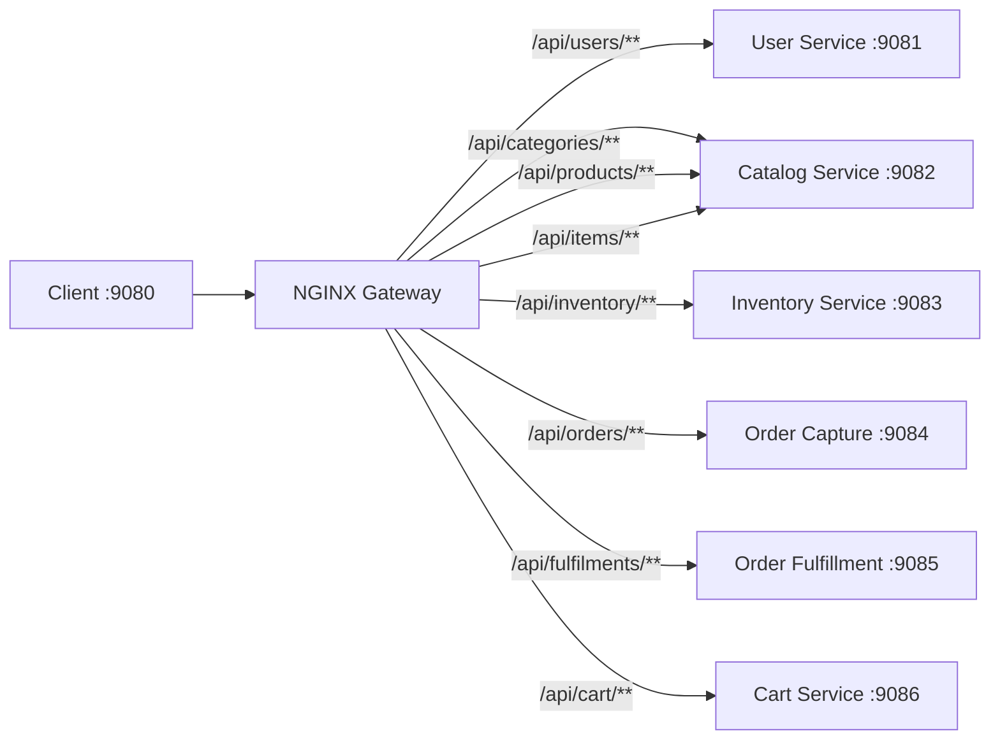

# API Gateway — WildFly MicroProfile

The **API Gateway** for the WildFly stack is an NGINX-based reverse proxy that provides a unified entry point on port `9080`, routing requests to the individual WildFly microservices deployed on their respective high ports (`9081`-`9086`).

> **Important**: The `api-gateway` Java module in this directory compiles a minimal JAX-RS application but has an **empty Dockerfile** and is **not deployed** as a container in `docker-compose.yml`. The actual routing is handled by the NGINX configuration file at `src/main/api-gateway.conf`, which is intended to be run manually or integrated into a custom deployment.

---

## Technology Stack

- **Proxy Runtime**: NGINX (manual deployment via `api-gateway.conf`)
- **Java Module**: Jakarta EE 10 / MicroProfile 6.1 (compiled but not deployed)

---

## Routing Architecture

## Route Mapping Table

The NGINX config rewrites the unified `/api/*` paths into the service-specific WAR context roots:

| Inbound Path | Rewrite Target | Upstream |
|---|---|---|
| `/api/users/**` | `/user-service/users/**` | `127.0.0.1:9081` |
| `/api/categories/**` | `/catalog-service/categories/**` | `127.0.0.1:9082` |
| `/api/products/**` | `/catalog-service/products/**` | `127.0.0.1:9082` |
| `/api/items/**` | `/catalog-service/items/**` | `127.0.0.1:9082` |
| `/api/inventory/**` | `/inventory-service/inventory/**` | `127.0.0.1:9083` |
| `/api/orders/**` | `/order-capture-service/orders/**` | `127.0.0.1:9084` |
| `/api/fulfilments/**` | `/order-fulfillment-service/fulfilments/**` | `127.0.0.1:9085` |
| `/api/cart/**` | `/cart-service/cart/**` | `127.0.0.1:9086` |

---

## Security

Unlike the Spring Boot API Gateway, this NGINX configuration does **not** perform JWT validation. There is no `proxy_set_header Authorization` directive and no Keycloak integration at the gateway level. Requests are forwarded as-is to the downstream services, which themselves also lack security validation.

---

## Known Issues

- The Java `api-gateway` module Dockerfile is empty (0 bytes), so the module cannot be built as a container.
- The NGINX config references `127.0.0.1` (loopback), making it incompatible with the Docker Compose network where services are addressed by container name. This config is designed for bare-metal or single-host deployments.
- There is no corresponding `wf-api-gateway` service in `docker-compose.yml`, though `prometheus.yml` references a scrape target at `wf-api-gateway:8080`, which will fail DNS resolution.
