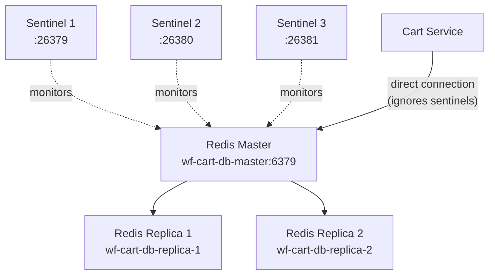

# Cart Service — WildFly MicroProfile

The **Cart Service** manages customer shopping carts for the WildFly stack using **Redis** as its data store. Unlike the Spring Boot equivalent which uses Spring Data Redis, this service uses the raw **Jedis** client library directly.

---

## Technology Stack

- **Runtime**: WildFly Application Server (latest)
- **Language**: Java 17
- **Framework**: Jakarta EE 10, MicroProfile 6.1
- **Data Store**: Redis 7 (Master-Replica-Sentinel topology)
- **Redis Client**: Jedis (direct `JedisPool` connection)
- **Configuration**: MicroProfile Config (`microprofile-config.properties`)
- **Packaging**: WAR (`cart-service.war`)

---

## Redis Topology

The Docker Compose configuration deploys a full Redis high-availability cluster for this service:

> **Warning**: Although the Docker Compose configuration provisions three Redis Sentinel nodes and passes `REDIS_SENTINEL_HOSTS` and `REDIS_MASTER_NAME` environment variables to the container, the Java implementation (`CartRepository.java`) **ignores these entirely**. It creates a standard `JedisPool` connecting directly to the master host (`wf-cart-db-master:6379`) as specified in `microprofile-config.properties`. The sentinel environment variables are never read by the application code, meaning automatic failover is not functional.

---

## API Endpoints

All endpoints are exposed under the WAR context root `/cart-service`.

| Method | Path | Description |
|---|---|---|
| `GET` | `/cart/{userId}` | Retrieve the cart for a user. |
| `POST` | `/cart/{userId}/items` | Add an item to the cart. Body: `AddToCartRequest`. |
| `PUT` | `/cart/{userId}/items/{sku}` | Update item quantity. Body: `QuantityUpdateRequest`. |
| `DELETE` | `/cart/{userId}/items/{sku}` | Remove an item from the cart. |
| `DELETE` | `/cart/{userId}` | Clear the entire cart. |

---

## Configuration

Defined in `src/main/resources/META-INF/microprofile-config.properties`:

| Property | Value | Description |
|---|---|---|
| `redis.host` | `wf-cart-db-master` | Redis master hostname. |
| `redis.port` | `6379` | Redis master port. |

---

## Security

No security validation is implemented. All endpoints are publicly accessible.

---

## Docker Configuration

| Property | Value |
|---|---|
| Container Name | `wf-cart-service` |
| Internal Port | `8080` |
| Mapped Host Port | `9086` |
| Redis Master | `wf-cart-db-master` |
| Sentinel Nodes | `wf-cart-sentinel-{1,2,3}` (configured but unused by application) |
