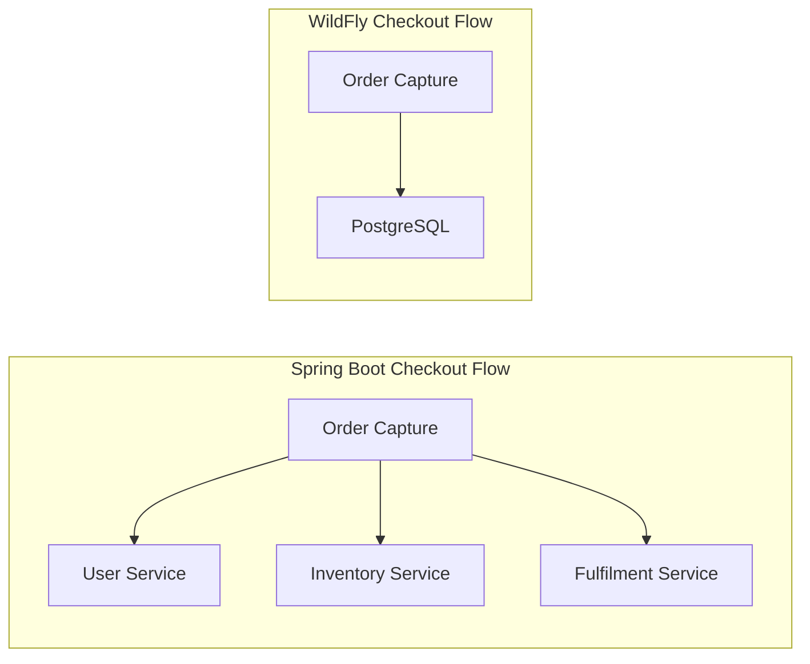

# Order Capture Service — WildFly MicroProfile

The **Order Capture Service** records customer orders for the WildFly stack. Unlike the Spring Boot counterpart which orchestrates a multi-service checkout flow, this service operates as a **standalone database writer** with no inter-service communication.

---

## Technology Stack

- **Runtime**: WildFly Application Server (latest)
- **Language**: Java 17
- **Framework**: Jakarta EE 10, MicroProfile 6.1
- **Database Access**: Jakarta Persistence (JPA) with Hibernate
- **Database**: PostgreSQL 16 (backed by `wf-order-capture-db` container)
- **Packaging**: WAR (`order-capture-service.war`)

---

## Key Architectural Differences from Spring Boot

The Spring Boot Order Capture Service orchestrates a distributed checkout flow involving three downstream services. The WildFly version performs none of this:

| Feature | Spring Boot | WildFly |
|---|---|---|
| User Validation | Synchronous call to User Service | Not performed |
| Stock Reservation | Synchronous call to Inventory Service | Not performed |
| Fulfilment Trigger | Synchronous call to Fulfilment Service | Not performed |
| Circuit Breakers | Resilience4j with fallback | Not applicable |
| Security | OAuth2 JWT validation | None |

---

## Database Schema

### `ORDERS` Table
| Column | Type | Constraints | Description |
|---|---|---|---|
| `ORDERID` | `UUID (VARCHAR 36)` | Primary Key (auto-generated) | Unique order identifier. |
| `USERID` | `VARCHAR(80)` | Not Null | Customer identifier. |
| `ADDRESS` | `VARCHAR` | Not Null | Shipping address. |
| `TOTALPRICE` | `NUMERIC(10,2)` | — | Order total amount. |
| `ORDERDATE` | `TIMESTAMP` | — | Auto-set on persist. |
| `STATUS` | `VARCHAR` (Enum) | Not Null, Default: `CREATED` | Order state. |

### `LineItem` Table
| Column | Type | Constraints | Description |
|---|---|---|---|
| `id` | `UUID` | Primary Key (auto-generated) | Line item identifier. |
| `item_sku` | `VARCHAR` | — | Item SKU reference. |
| `product_name` | `VARCHAR` | — | Product display name. |
| `quantity` | `INTEGER` | — | Ordered quantity. |
| `unit_price` | `NUMERIC` | — | Price per unit. |
| `order_id` | `UUID` | Foreign Key to `ORDERS` | Parent order reference. |

---

## API Endpoints

All endpoints are exposed under the WAR context root `/order-capture-service`.

| Method | Path | Description |
|---|---|---|
| `POST` | `/orders` | Place a new order. Body: `OrderDto` JSON. |
| `GET` | `/orders` | List all orders. |
| `GET` | `/orders/{id}` | Get order by ID (UUID). |
| `GET` | `/orders/user/{userId}` | Get all orders for a specific user. |

---

## Security

No security validation is implemented. All endpoints are publicly accessible.

---

## Docker Configuration

| Property | Value |
|---|---|
| Container Name | `wf-order-capture-service` |
| Internal Port | `8080` |
| Mapped Host Port | `9084` |
| Database Container | `wf-order-capture-db` |
| Database Name | `ordercapturedb` |
