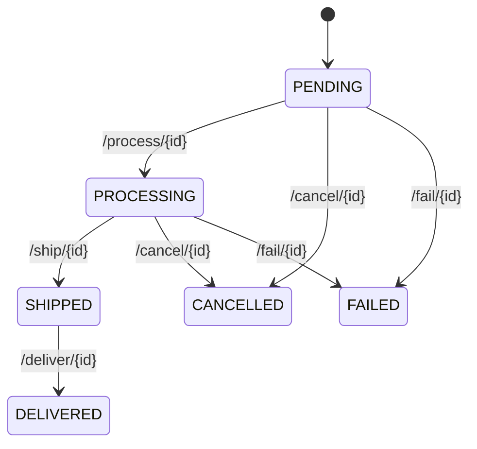

# Order Fulfillment Service — WildFly MicroProfile

The **Order Fulfillment Service** manages the shipping lifecycle of orders for the WildFly stack. It provides CRUD operations and status transition endpoints for tracking order shipments from creation to delivery.

---

## Technology Stack

- **Runtime**: WildFly Application Server (latest)
- **Language**: Java 17
- **Framework**: Jakarta EE 10, MicroProfile 6.1
- **Database Access**: Jakarta Persistence (JPA) with Hibernate
- **Database**: PostgreSQL 16 (backed by `wf-order-fulfillment-db` container)
- **Packaging**: WAR (`order-fulfillment-service.war`)

---

## Database Schema (`OrderFulfillment` Entity)

| Column | Type | Constraints | Description |
|---|---|---|---|
| `order_id` | `VARCHAR` | Primary Key | Order identifier (manually assigned). |
| `user_id` | `VARCHAR` | — | Customer identifier. |
| `order_date` | `VARCHAR` | — | Order date (stored as string, not timestamp). |
| `status` | `VARCHAR` | — | Current fulfillment status. |
| `shipping_address` | `VARCHAR` | — | Delivery address. |
| `tracking_number` | `VARCHAR` | — | Carrier tracking reference. |
| `total_amount` | `DOUBLE` | — | Order total (stored as primitive double, not BigDecimal). |

Note: The schema uses `String` for dates and `double` for monetary values, which differ from the Spring Boot counterpart that uses proper `Instant` timestamps and `BigDecimal` precision types.

---

## Status Lifecycle

---

## API Endpoints

All endpoints are exposed under the WAR context root `/order-fulfillment-service`.

| Method | Path | Description |
|---|---|---|
| `POST` | `/fulfillment/add` | Create a fulfillment record. |
| `GET` | `/fulfillment/all` | List all fulfillment records. |
| `GET` | `/fulfillment/{id}` | Get fulfillment by order ID. |
| `PUT` | `/fulfillment/update` | Update a fulfillment record. Body: full entity JSON. |
| `DELETE` | `/fulfillment/{id}` | Delete a fulfillment record. |
| `PUT` | `/fulfillment/process/{id}` | Transition to PROCESSING status. |
| `PUT` | `/fulfillment/ship/{id}` | Transition to SHIPPED status. |
| `PUT` | `/fulfillment/deliver/{id}` | Transition to DELIVERED status. |
| `PUT` | `/fulfillment/cancel/{id}` | Transition to CANCELLED status. |
| `PUT` | `/fulfillment/fail/{id}` | Transition to FAILED status. |
| `GET` | `/fulfillment/status/{status}` | List records by status. |
| `GET` | `/fulfillment/tracking/{trackingNumber}` | Look up by tracking number. |
| `GET` | `/fulfillment/count` | Count total fulfillment records. |
| `GET` | `/fulfillment/revenue` | Sum total revenue across all orders. |

---

## Security

No security validation is implemented. All endpoints are publicly accessible.

---

## Docker Configuration

| Property | Value |
|---|---|
| Container Name | `wf-order-fulfillment-service` |
| Internal Port | `8080` |
| Mapped Host Port | `9085` |
| Database Container | `wf-order-fulfillment-db` |
| Database Name | `orderfulfillmentdb` |

---

## Known Issues

- **Prometheus DNS Mismatch**: The `prometheus.yml` scrape target references `wf-order-fulfilment-service` (UK spelling), but the container is named `wf-order-fulfillment-service` (US spelling). This causes the Prometheus scrape job to fail for this service.
